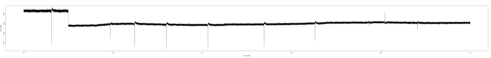

# tdmsreader

Read LabVIEW TDMS files using R

## Install

    devtools::install_github('msuefishlab/tdmsreader')

Check installation with

    library(tdmsreader)

## Usage

A command line script named is also installed. It might not be installed to a normal bin directory, so you can locate it with

    Rscript -e "system.file('scripts', 'tdmsreader', package='tdmsreader')"

The usage of the script is

    tdmsreader <input.tdms> <output.png>

The command line script is a simple example of usage of the `tdmsreader` library

## Screenshot

## Credit

This code couldn't have been done without the python npTDMS and is an almost direct port of of it https://github.com/adamreeve/npTDMS

